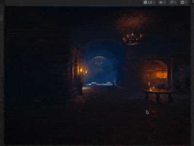

🏰 Dungeon Escape
Unreal Engine 5 Game Project

  
 
 <em>A timed puzzle-based dungeon exploration game developed using Unreal Engine 5.</em> 

🎮 Game Overview

Dungeon Escape is a time-sensitive puzzle and exploration game built in Unreal Engine 5.
The core gameplay revolves around environmental triggers, key-based progression, and strategic decision-making under time constraints.

The game begins when the player steps onto a pressure plate, which activates a timed gate. The player must quickly enter the dungeon chamber and retrieve an initial key before the gate closes. Failure to do so results in an immediate game loss.

Once the key is collected, it must be placed on a statue, unlocking access to an underground dungeon. The player then descends the stairs to retrieve the final exit key. Returning to the main level, the player unlocks the final gate and successfully completes the game.

🧠 Core Gameplay Mechanics

⏱️ Timed gate activation

🗝️ Key collection and placement

🚪 Door and gate animation control

📦 Trigger-based player detection

👁️ Line-of-sight validation for item pickup

🧩 Class Architecture & Responsibilities
🔐 Lock.cpp

Tracks the lock state of interactive objects.
Uses the isKeyPlaced boolean variable to determine whether a lock can be unlocked.

🗝️ CollectibleItem.cpp

Manages collectible objects such as keys.
When an item is collected, it uses the AddTag function to register the key as acquired by the player.

🚪 MoveDoor.cpp

Handles the opening and closing of doors and gates.
Implements smooth movement by interpolating between a defined start position and a destination position.

📦 TrigBoxComponent.cpp

Responsible for detecting player interaction with pressure plates.
Uses a box collider to trigger events when the player steps onto or off the plate.

🎯 MyProject7Projectile.cpp

Implements the key collection mechanic.
Uses OnComponentHit to:

Measure the distance between the player and the key

Verify a clear line of sight before allowing the key to be collected

🛠️ Technologies Used

Unreal Engine 5

C++ Gameplay Programming

Collision & Trigger Systems

Animation & Transform Interpolation

📌 Demo

🎥 The gameplay demo above (dungeon.gif) is included at the root of this repository and showcases the full dungeon escape flow, including gate activation, key collection, and level completion.
